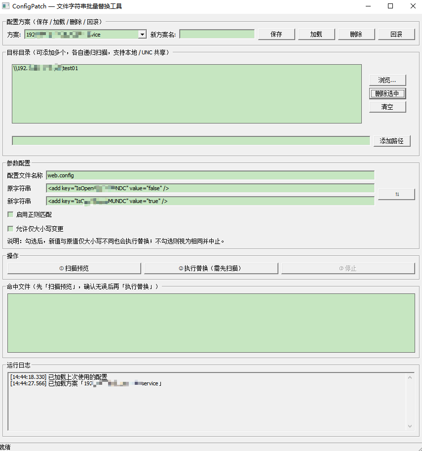

# ConfigPatch — 文件字符串批量替换工具

一个运行于 Windows 平台的 **Go + Walk 原生图形界面** 工具，用于在多个目标目录（本地或 UNC 共享）内递归查找指定文件（默认 `web.config`，可扩展到任何文本/配置文件），对包含指定原字符串的文件执行 **备份 → 生成新文件 → 覆盖原文件** 的替换操作，并严格保留原文件编码。不限于 IIS 配置，任何文件的字符串批量替换都适用。



<center>ConfigPatch 主界面：配置方案 → 目标目录 → 参数配置 → 扫描预览 → 执行替换 → 运行日志</center>

## 功能特性

- **多目标目录**：可添加多个本地目录或 UNC 共享路径（如 `\\192.168.0.100\d$\WebSite`），各自递归扫描所有子目录。

- **直接输入路径**：除"浏览..."外，可直接在输入框**输入本地或 UNC 共享路径**（回车或点"添加路径"），适用于未映射到本地盘符、浏览对话框打不开的共享目录。

- **文件名称可扩展**：默认 `web.config`，可填写多个（逗号分隔），如 `web.config,app.config`，文件名匹配不区分大小写。

- **大小写不敏感查找/替换**：命中判断与替换均不区分大小写；替换时把文件内**所有出现**替换为新字符串原文。

- **正则匹配开关**：勾选「启用正则匹配」后，配置文件名称按正则完整匹配（不区分大小写、自动加 ^...$ 锚定），原字符串按 RE2 正则查找（默认区分大小写，`(?i)` 前缀改为不区分），新字符串支持 `$1`/`${name}` 捕获组引用（`$$` 表示字面 `$`）；默认不勾选即为精确匹配，行为不变。

- **仅大小写变更开关**：默认新值与原值**忽略大小写**相同即弹警告中止（拦截仅改大小写）；勾选"允许仅大小写变更"后，仅大小写不同也会正常执行替换。

- **先预览后执行**：扫描后列出全部命中文件，人工确认后才执行替换，避免误操作。

- **自动备份 + 审计**：每个命中文件所在目录生成 `backup-config\`，保存：

  - 原始文件快照 `<文件名>-YYYYMMDDHHMMSS`（每次运行一份，**绝不覆盖已有备份**，冲突自动追加序号）；

  - 最新更改版 `<文件名>-new`（如 `web-new.config`，每次覆盖为最新）。

- **强一致保留原编码**：自动识别 UTF-8（带/不带 BOM）、UTF-16 LE/BE、ANSI/GBK，替换后按原编码写回，中文注释、换行符完全不变。

- **替换后校验 + 自动回滚**：覆盖后重新读取文件校验新值已写入；失败则用备份自动恢复原文件。

- **运行日志**：实时显示在界面，同时写入程序目录下 `logs\run-YYYYMMDD-HHMMSS.mmm.log`（文件名精确到毫秒，同一毫秒并发运行自动追加 `_1/_2...`）。日志每行带完整时间戳（含毫秒），并逐步记录每个文件的处理过程（处理 → 备份 → 生成新文件 → 覆盖 → 校验/回滚），便于审计排障。

- **随时可停止**：扫描或执行替换过程中可随时点「③ 停止」中断：扫描保留已扫到的部分结果并明确提示未完成；替换保留已处理完的文件（各有 `backup-config` 备份）；关闭窗口也会同时停止后台任务。

- **配置方案保存/加载**：可把目标目录、文件名、原值、新值、仅大小写开关存为命名方案，随时加载、覆盖、删除；界面自动记忆上次使用的配置，下次打开自动恢复。

- **历史回滚**：自动保存不会破坏好配置——保留最近 5 版历史快照，可一键回滚到上一版；命名方案永不被自动保存覆盖，长期可靠。

- **健壮性**：自动跳过 `backup-config` 目录；遇到无权限/被占用（IIS 锁定）文件时去只读属性重试、记录错误并继续处理其它文件，不影响整体。

## 使用说明

1. （可选）在顶部"配置方案"区：从下拉框选择并点「加载」恢复某方案；点「保存为方案」把当前配置存为命名方案（在下方「方案名」输入框填写新方案名，留空则覆盖当前选中的方案）；误改后可点「回滚上一版」恢复。
2. 双击运行 `ConfigPatch.exe`（无需安装任何运行时）。
3. **目标目录**：

   - 点"浏览..."选择本地目录；或

   - 在下方输入框**直接输入本地或 UNC 共享路径**，回车或点"添加路径"（可加多个）。
4. **参数配置**：

   - 文件名称（默认 `web.config`，可多个，逗号分隔）；

   - 原字符串（查找并替换的内容）；

   - 新字符串（替换为的内容）；

   - 如需"仅改大小写"，勾选"允许仅大小写变更"。

   - 需要模式匹配时，勾选「启用正则匹配」：文件名/原字符串按正则解释，新字符串支持捕获组引用。
5. 点 **① 扫描预览**，在"命中文件"列表确认命中的文件。
6. 点 **② 执行替换**，确认后程序自动完成：备份 → 生成新文件 → 覆盖原文件 → 校验。
7. 如需中途停止，点「③ 停止」即可中断当前扫描或替换；关闭窗口同样会停止后台任务。

> 注意：程序需要能访问目标共享目录的权限（访问 `\\server\d$` 管理共享通常需要目标机管理员权限）。

## 构建方法（需 Go 1.25+，Windows 上运行）

```bat
go mod tidy
go build -ldflags "-H windowsgui" -o ConfigPatch.exe .
go test ./...
```

## 目录结构

```
ConfigPatch/
├── main.go             # Walk 图形界面主程序
├── core/
│   ├── core.go         # 扫描 / 匹配 / 替换 / 备份 / 校验 / 回滚 核心逻辑
│   ├── encoding.go     # 编码识别与强一致编解码
│   └── core_test.go    # 核心逻辑单元测试
├── vendor/             # 已 vendor 的依赖（含 Walk 兼容性补丁）
├── go.mod / go.sum
├── ConfigPatch.exe     # 已构建的可执行文件
└── README.md
```

## 安全边界

- 只操作界面中给定的目标目录范围，绝不触碰范围外文件。

- 先备份成功才动原文件；替换失败或校验失败自动回滚，原文件不损坏。

- 原字符串为空、新值为空、目标目录不可访问等都会先拦截并提示。

## 兼容性说明（重要）

部分 Windows 会话（如受限/非交互桌面）在 Win32 层面**无法创建工具提示控件**（`TTM_ADDTOOL` 返回失败且无错误码）。Walk 库默认把这一纯装饰性功能的失败当作硬错误，会导致窗口创建中止、程序静默退出（"双击打不开"）。

本项目已通过 `go mod vendor` 将依赖打入 `vendor/`，并对
`vendor/github.com/lxn/walk/tooltip.go` 打补丁：**ToolTip 创建失败时忽略、不中断窗口创建**。该补丁只影响悬停提示这一装饰功能，不影响任何业务功能。

如后续需要升级 Walk，请重新执行 `go mod vendor` 并重新应用此补丁。

### 正则语法（RE2）与安全策略

- 正则匹配使用 Go 的 RE2 引擎：**不支持** lookahead/lookbehind（`(?=...)`、`(?<=...)`）与模式内反向引用（`\1`）；替换侧支持 `$1`/`${name}` 捕获组。习惯 Notepad++（PCRE）写法时请注意差异。

- 正则模式下新字符串中的 `$` 有特殊含义：`$1`/`${name}` 是捕获组引用（`$1` 若没有对应分组则展开为空串），需要输出字面 `$` 时写 `$$`。未勾选「启用正则匹配」时 `$` 原样输出。

- **原字符串正则会拒绝可匹配空字符串的模式**（如 `(?i)`、`a*`、`^`、`$`、纯 `\B`）：否则每个文件都会被命中、替换会在所有位置插入。请注意，纯零宽断言 `\b` 无法被该检查识别（`\b` 不匹配空字符串），但同样会造成每个文件命中，请勿用作原字符串。

### 正则常用案例速查

> 前提：勾选「启用正则匹配」。此时「文件名」按整名**完整匹配且自动忽略大小写**（内部包装成 `(?i)^(?:…)$`），「原字符串」为 RE2 正则（区分大小写，可用 `(?i)` 前缀忽略），「新字符串」为替换模板（`$1`/`${name}` 捕获组，`$$` 表示字面 `$`）。

#### 替换内容（原字符串 → 新字符串）

| 场景          | 原字符串（正则）                     | 新字符串          | 效果/说明                 |
| ----------- | ---------------------------- | ------------- | --------------------- |
| 端口号翻新（捕获保留） | `:(\d+)`                     | `:$1`         | 只换端口，`$1` 引用捕获的数字     |
| 强制大小写       | `(?i)maxpoolsize`            | `MaxPoolSize` | `(?i)` 开头=不区分大小写      |
| 指定值加前后缀     | `(server=\S+)`               | `pre.$1`      | 保留原值并加前缀              |
| 命名捕获组重排     | `(?P<user>\w+)@(?P<dom>\w+)` | `$dom.$user`  | `${name}` 引用命名组       |
| 两段交换        | `(\w+)\.(\w+)`               | `$2.$1`       | 把 `a.b` 交换成 `b.a`     |
| 输出字面 `$`    | `price=\d+`                  | `price=$$100` | `$$` 才输出普通 `$`        |
| 给值加引号       | `key="([^"]*)"`              | `key="[$1]"`  | `[^"]*`=非引号字符，加包裹     |
| 一次替换所有数字    | `\d+`                        | `1024`        | 每个数字命中都替换             |
| 日期翻年        | `\d{4}-\d{2}-\d{2}`          | `2026-01-01`  | 定长写法                  |
| 路径反斜杠转斜杠    | `\\`                         | `/`           | 正则里 `\\`=字面一个反斜杠      |
| 空白/缩进归一     | `\s+`                        | ` `           | 多空格/制表/换行折成单空格        |
| 删除某类注释行     | `(?m)^\s*#.*$`               | （留空）          | `(?m)` 让 `^`、`$` 逐行生效 |

#### 文件名匹配（文件名框）

| 想匹配的文件              | 填入                               |
| ------------------- | -------------------------------- |
| 所有 web.config 类     | `web.*\.config`                  |
| 精确 appsettings.json | `appsettings\.json`（点要转义）        |
| 按环境各一份              | `web\.(dev\|test\|prod)\.config` |
| 前缀开头                | `proxy-.*`                       |
| 文件名带 2+ 位数字         | `.*\d{2,}\.config`               |

#### RE2 语法边界（避免踩坑）

- **支持**：`()` 捕获组、`(?i)`/`(?m)`、`.*` 等量词、字符类 `[a-z\d_]`、锚 `^`/`$`、`\d`/`\w`/`\s`。

- **不支持**：反向引用 `\1`、环视（前瞻 `(?=)` / 后瞻 `(?<=)`）、条件等回溯特性——用了会报错或不符合预期。

- **会被工具拒绝**：能匹配**空串**的零宽正则（如单写 `\b`、`^`、`$`），工具为防死循环会拒绝执行（`\b` 属例外，不报错但仍会造成每个文件命中，勿用作原字符串）。

#### 记忆口诀（三板斧）

1. **保留原片段** → 原字符串加 `(...)`，新字符串用 `$1` 引用；
2. **忽略大小写** → 原字符串开头写 `(?i)`；
3. **输出真正的** **`$`** → 新字符串里写 `$$`。

